# From Black-Box to Explainability: Probabilistic Automata for Time Series Analysis

**Yazılım Geliştirme Dersi — YazLab II Proje II**  
**Grup:** 24  
**Teslim Tarihi:** 7 Haziran 2026

---

## İçindekiler

1. [Giriş](#1-giriş)
2. [Araştırma Problemi ve Amaç](#2-araştırma-problemi-ve-amaç)
3. [Veri Setleri](#3-veri-setleri)
4. [Yazılım Mimarisi](#4-yazılım-mimarisi)
5. [Veri Ön İşleme](#5-veri-ön-işleme)
6. [Modeller](#6-modeller)
7. [Deneysel Tasarım](#7-deneysel-tasarım)
8. [Deney Sonuçları](#8-deney-sonuçları)
9. [İstatistiksel Analiz](#9-istatistiksel-analiz)
10. [Olasılıksal Açıklanabilirlik Modülü](#10-olasılıksal-açıklanabilirlik-modülü)
11. [Görselleştirmeler](#11-görselleştirmeler)
12. [Kurulum ve Çalıştırma](#12-kurulum-ve-çalıştırma)
13. [Sonuç ve Tartışma](#13-sonuç-ve-tartışma)
14. [Referanslar](#14-referanslar)

---

## 1. Giriş

Zaman serisi verileri; endüstriyel sensör ağları, IoT altyapıları ve kritik altyapı sistemlerinde yaygın biçimde kullanılmaktadır. Bu veriler üzerinde gerçekleştirilen anomali tespiti, hem operasyonel güvenlik hem de erken uyarı sistemleri açısından büyük önem taşır.

Bu proje kapsamında, zaman serisi anomali tespiti problemi üzerinde **iki farklı modelleme paradigması** karşılaştırılmaktadır:

- **Derin öğrenme tabanlı modeller** (LSTM, GRU ve 1D-CNN Autoencoder): Yüksek doğruluk potansiyeline sahip, ancak karar süreci doğrudan yorumlanması zor *black-box* yaklaşımlar.
- **Olasılıksal otomata tabanlı model** (PAA → SAX → Markov geçişleri): Sembolik temsil ve durum geçiş olasılıkları üzerinden **yorumlanabilir** karar üreten yaklaşım.

Proje; SKAB ve BATADAL veri setleri üzerinde modellerin performansını, gürültüye dayanıklılığını, unseen (görülmemiş) örüntü davranışını ve açıklanabilirliğini sistematik biçimde analiz etmeyi hedefler. Amaç tek bir “en iyi modeli” ilan etmek değil; farklı veri koşulları altında model davranışlarını bilimsel olarak karşılaştırmaktır.

---

## 2. Araştırma Problemi ve Amaç

**Araştırma sorusu:** Farklı modelleme yaklaşımları, zaman serisi verileri üzerinde farklı veri koşulları altında nasıl davranmaktadır ve bu farklar istatistiksel olarak anlamlı mıdır?

**Proje hedefleri:**

- Derin öğrenme ve otomata tabanlı yaklaşımların karşılaştırmalı analizi
- Model performansının veri setine bağımlılığının incelenmesi
- Gürültü ve bilinmeyen örüntü (unseen) durumlarında model davranışının değerlendirilmesi
- Olasılıksal geçişler üzerinden açıklanabilirlik sunulması

---

## 3. Veri Setleri

### 3.1 SKAB

| Özellik | Değer |
|---------|-------|
| Kullanılan klasörler | `valve1`, `valve2` |
| Toplam kayıt | 22.472 |
| Özellik sayısı | 8 sensör |
| Hedef değişken | `anomaly` |
| Ek meta sütunlar | `source_group`, `source_file` |

**Sensör özellikleri:** Accelerometer1RMS, Accelerometer2RMS, Current, Pressure, Temperature, Thermocouple, Voltage, Volume Flow RateRMS

**Birleştirme kuralları:**
- `valve1` ve `valve2` altındaki tüm `.csv` dosyaları birleştirilir.
- Her kayda `source_group` (valve1/valve2) ve `source_file` (kaynak dosya adı) eklenir.
- Bu sütunlar model girdisine **dahil edilmez**; yalnızca dosya bazlı bölme ve analiz için kullanılır.
- `datetime`, `changepoint`, `source_group`, `source_file` model girdisinden hariç tutulur.

### 3.2 BATADAL

| Özellik | Değer |
|---------|-------|
| Kullanılan dosya | `BATADAL_dataset04.csv` (Resmi **Training Dataset 2**) |
| Toplam kayıt | 4.177 |
| Özellik sayısı | 43 sensör |
| Hedef değişken | `ATT_FLAG` |
| Etiket dağılımı | 3.958 normal (0), 219 saldırı (1) |

**Önemli notlar:**
- Training Dataset 1 yalnızca normal veri içerdiği için kullanılmamıştır.
- Test Dataset etiket içermediği için performans değerlendirmesinde kullanılmamıştır.
- Ham veride `-999` değerleri kısmen etiketlenmiş kayıtları temsil eder; yükleme sırasında `0` (normal) olarak normalize edilmiştir.
- Zaman sütunları yalnızca kronolojik bölme için kullanılır; doğrudan model girdisine alınmaz.

---

## 4. Yazılım Mimarisi

Proje, merkezi konfigürasyon ve modüler pipeline prensiplerine göre tasarlanmıştır. Tüm hiperparametreler `configs/config.json` dosyasında tutulur; hard-coded değer kullanılmaz.

```
Anomali-Tespiti-YazLab-II-Proje-II/
├── configs/
│   └── config.json              # Merkezi konfigürasyon
├── data/
│   └── raw/
│       ├── SKAB/valve1/, valve2/
│       └── BATADAL_dataset04.csv
├── logs/                        # Deney logları ve grafikler
├── scripts/
│   ├── check_data.py            # Veri doğrulama
│   └── generate_sample_data.py  # Örnek veri üretimi
├── src/
│   ├── pipeline.py              # Ana deney akışı
│   ├── models/
│   │   ├── automata.py          # Olasılıksal otomata
│   │   ├── deep_learning.py     # LSTM / GRU / 1D-CNN autoencoder
│   │   └── trainer.py           # DL eğitim yöneticisi
│   ├── preprocessing/
│   │   ├── data_loader.py       # SKAB/BATADAL yükleme, GroupKFold
│   │   ├── preprocessor.py      # Normalizasyon, PCA
│   │   ├── sax_converter.py     # SAX dönüşümü
│   │   └── noise_injector.py    # Gaussian gürültü
│   └── utils/
│       ├── analyzer.py          # Parametre duyarlılık analizi
│       ├── logger.py            # Deney loglama
│       ├── metrics.py           # Performans metrikleri
│       ├── statistics.py        # Wilcoxon / McNemar testleri
│       └── visualizer.py        # Grafik üretimi
├── tests/
│   └── test_automata.py         # Levenshtein birim testleri
├── main.py
├── run.bat
└── requirements.txt
```

**Pipeline akışı:** Veri yükleme → Senaryo uygulama (original/noisy/unseen) → Normalizasyon → PCA (otomata) / DL sekans oluşturma → Model eğitimi ve tahmin → Metrik loglama → İstatistiksel analiz → Görselleştirme

---

## 5. Veri Ön İşleme

| Adım | Açıklama | Data Leakage Önlemi |
|------|----------|---------------------|
| Normalizasyon | `StandardScaler` ile z-score | Scaler yalnızca train üzerinde fit |
| Eksik veri | Ortalama ile doldurma | Train istatistiği kullanılır |
| PCA | Çok değişkenli veri → PC1 (tek boyut) | PCA yalnızca train üzerinde fit |
| SAX | PC1 üzerinde sembolik dönüşüm | Breakpoint'ler train istatistiği ile hesaplanır |
| SAX z-normalize | Train mean/std ile normalize edilmiş PC1 | Test/val'a aynı istatistik uygulanır |

Otomata modeli tek boyutlu veri gerektirdiğinden, SKAB (8 özellik) ve BATADAL (43 özellik) verilerinde tüm sensörler PCA ile birinci bileşene (PC1) indirgenmiştir.

---

## 6. Modeller

### 6.1 Derin Öğrenme Modelleri (Autoencoder)

Üç DL modeli de **yeniden yapılandırma hatası (reconstruction error)** tabanlı anomali tespiti kullanır:

| Model | Mimari Özeti |
|-------|--------------|
| **LSTM Autoencoder** | LSTM(64→32) encoder, RepeatVector + LSTM(32→64) decoder |
| **GRU Autoencoder** | GRU(64→32) encoder, RepeatVector + GRU(32→64) decoder |
| **1D-CNN Autoencoder** | Conv1D katmanları (32→16→8→16→32→n_features) |

- Anomali eşiği: Validation setindeki reconstruction error'un **95. persentili**
- Sekans uzunluğu: 10 zaman adımı
- Optimizer: Adam (lr = 0.001), kayıp: MSE

### 6.2 Olasılıksal Otomata Modeli

| Bileşen | Açıklama |
|---------|----------|
| **PAA** | Piecewise Aggregate Approximation (segment_size = 1) |
| **SAX** | Symbolic Aggregate approXimation (alphabet_size = 3) |
| **Sliding Window** | window_size = 4 ile örüntü çıkarımı |
| **Geçiş olasılıkları** | Frekans tabanlı: P(Si→Sj) = (count + α) / (total + α×|targets|) |
| **Smoothing** | Laplace smoothing (α = 1.0) |
| **Anomali kararı** | Path probability < 0.05 → ANOMALY |
| **Unseen yönetimi** | Levenshtein Edit Distance ile en yakın bilinen pattern'e eşleme |

**Path probability hesabı:**

```
P(sequence) = ∏ P(Si → Si+1)
```

Düşük olasılıklı yollar anomali adayı olarak işaretlenir.

---

## 7. Deneysel Tasarım

### 7.1 Deney Protokolü

| Parametre | Değer |
|-----------|-------|
| Random seed'ler | 42, 123, 2026, 7, 999 |
| Epoch üst sınırı | 50 |
| Batch size | 32 |
| Early stopping | Validation loss, patience = 5 |
| Gürültü | Gaussian, μ=0, σ=0.05 |

### 7.2 Veri Bölme Stratejileri

| Veri Seti | Strateji |
|-----------|----------|
| **SKAB** | `source_file` bazlı **StratifiedGroupKFold** (5 fold). Aynı CSV hem train hem test'te yer almaz. |
| **BATADAL** | Kronolojik **%60 eğitim / %20 doğrulama / %20 test** |

### 7.3 Senaryolar

| Senaryo | Açıklama |
|---------|----------|
| **original** | Ham veri |
| **noisy** | Gaussian gürültü (σ=0.05) eklenmiş veri |
| **unseen** | Eğitim SAX sözlüğünde bulunmayan pattern'lar; DL modelleri atlanır, otomata + Levenshtein odaklı |

### 7.4 Parametre Analizi (Otomata)

**Sabit parametreler (karşılaştırma):** window_size = 4, alphabet_size = 3

**Varyasyon:** window_size ∈ {3, 4, 5, 6}, alphabet_size ∈ {3, 4, 5, 6}

Her kombinasyon için state sayısı, geçiş yoğunluğu, accuracy ve F1-score raporlanmıştır.

---

## 8. Deney Sonuçları

> Deney ID: `20260607_044225` | Metrikler: `logs/experiment_summary.csv` (272 satır)

### Tablo 1: Model Performansı ve Stabilitesi (Ortalama F1-score ± Standart Sapma)

**Orijinal senaryo, 5 seed ortalaması**

| Model | SKAB | BATADAL |
|-------|------|---------|
| LSTM | 0.1716 ± 0.0260 | 0.7642 ± 0.0043 |
| GRU | 0.1214 ± 0.0278 | 0.7680 ± 0.0037 |
| 1D-CNN | 0.2614 ± 0.0291 | 0.7699 ± 0.0016 |
| Automata | 0.0311 ± 0.0000 | 0.0202 ± 0.0000 |

**Yorum:** BATADAL'da üç DL modeli de F1 ≈ 0.76–0.77 ile otomata'dan (0.02) belirgin üstündür. SKAB'da 1D-CNN en yüksek ortalama F1'e sahiptir; fold bazlı varyans yüksektir. GRU, LSTM ile benzer mimaride olmasına rağmen SKAB'da daha düşük, BATADAL'da ise LSTM ile eşdeğer performans göstermiştir. Otomata düşük recall nedeniyle sınırlı F1 üretir; açıklanabilirlik avantajı sunar.

### Tablo 2: SKAB Fold Bazlı F1-Score Özeti (Seed = 42, Orijinal)

| Fold | LSTM | GRU | 1D-CNN | Automata |
|------|------|-----|--------|----------|
| 1 | 0.2175 | 0.1042 | 0.2393 | 0.0140 |
| 2 | 0.2050 | 0.3740 | 0.5346 | 0.0026 |
| 3 | 0.0776 | 0.0434 | 0.3119 | 0.0332 |
| 4 | 0.2681 | 0.0785 | 0.3292 | 0.0310 |
| 5 | 0.0440 | 0.0172 | 0.0289 | 0.0748 |
| **Ort.** | **0.1625** | **0.1235** | **0.2888** | **0.0311** |

Fold 2'de 1D-CNN en yüksek F1 (0.5346) değerine ulaşmıştır; bu durum anomali dağılımının dosyalar arası heterojenliğini göstermektedir.

### Tablo 3: BATADAL Test Kümesi Metrikleri (Orijinal Senaryo)

| Seed | Model | Accuracy | Precision | Recall | F1 |
|------|-------|----------|-----------|--------|-----|
| 42 | LSTM | 0.9323 | 0.6458 | 0.9490 | 0.7686 |
| 42 | GRU | 0.9335 | 0.6503 | 0.9490 | 0.7718 |
| 42 | 1D-CNN | 0.9323 | 0.6458 | 0.9490 | 0.7686 |
| 42 | Automata | 0.8834 | 0.0526 | 0.0125 | 0.0202 |
| 123 | LSTM | 0.9287 | 0.6327 | 0.9490 | 0.7592 |
| 123 | GRU | 0.9301 | 0.6375 | 0.9490 | 0.7623 |
| 123 | 1D-CNN | 0.9335 | 0.6503 | 0.9490 | 0.7718 |
| 2026 | LSTM | 0.9287 | 0.6327 | 0.9490 | 0.7592 |
| 2026 | GRU | 0.9323 | 0.6458 | 0.9490 | 0.7686 |
| 2026 | 1D-CNN | 0.9335 | 0.6503 | 0.9490 | 0.7718 |
| 7 | LSTM | 0.9323 | 0.6458 | 0.9490 | 0.7686 |
| 7 | GRU | 0.9335 | 0.6503 | 0.9490 | 0.7718 |
| 7 | 1D-CNN | 0.9323 | 0.6458 | 0.9490 | 0.7686 |
| 999 | LSTM | 0.9311 | 0.6414 | 0.9490 | 0.7654 |
| 999 | GRU | 0.9311 | 0.6414 | 0.9490 | 0.7654 |
| 999 | 1D-CNN | 0.9323 | 0.6458 | 0.9490 | 0.7686 |

### Tablo 4: Gürültü Etkisi (Ortalama F1-score)

| Model | SKAB (Orijinal) | SKAB (Gürültülü) | BATADAL (Orijinal) | BATADAL (Gürültülü) |
|-------|-----------------|------------------|--------------------|---------------------|
| LSTM | 0.1716 | 0.1672 | 0.7642 | 0.7624 |
| GRU | 0.1214 | 0.1381 | 0.7680 | 0.7576 |
| 1D-CNN | 0.2614 | 0.3343 | 0.7699 | 0.7738 |
| Automata | 0.0311 | 0.0465 | 0.0202 | 0.0582 |

**Yorum:** SKAB'da gürültü 1D-CNN performansını anlamlı biçimde artırmış (+0.07 F1); GRU'da da hafif iyileşme görülmüştür. BATADAL'da DL modelleri gürültüye karşı stabildir.

### Tablo 5: Gürültü Etkisi ve Unseen Analizi (Automata)

| Veri Seti | F1 (Orijinal) | F1 (Gürültülü) | F1 (Unseen) | Det. Rate | Map. Acc. |
|-----------|---------------|----------------|-------------|-----------|-----------|
| SKAB | 0.0311 | 0.0465 | 0.0311 | 0.0034 | 0.7692 |
| BATADAL | 0.0202 | 0.0582 | 0.0202 | 0.0012 | 0.7500 |

Unseen senaryoda DL modelleri atlanır; Levenshtein eşleme otomata üzerinde uygulanır. Kaynak: `logs/unseen_summary.csv`

### Tablo 6: Modellerin Çalışma Süresi (Runtime)

| Model | Training Time (sn) | Inference Time (sn) |
|-------|-------------------|---------------------|
| LSTM | 55.04 | 0.33 |
| GRU | 70.10 | 0.30 |
| 1D-CNN | 24.28 | 0.18 |
| Automata | 0.01 | 0.06 |

Kaynak: `logs/runtime_summary.csv` | Detay: `logs/runtime_comparison.csv`

### Tablo 7: Otomata Parametre Duyarlılık Analizi — SKAB (F1-score)

| Parametre | Değer = 3 | Değer = 4 | Değer = 5 | Değer = 6 |
|-----------|-----------|-----------|-----------|-----------|
| **Window Size** | 0.0141 | 0.0140 | 0.0115 | 0.0440 |
| **Alphabet Size** | 0.0140 | 0.0258 | 0.0649 | 0.0731 |

### Tablo 8: Otomata Parametre Duyarlılık Analizi — BATADAL (F1-score)

| Parametre | Değer = 3 | Değer = 4 | Değer = 5 | Değer = 6 |
|-----------|-----------|-----------|-----------|-----------|
| **Window Size** | 0.0000 | 0.0202 | 0.0325 | 0.0274 |
| **Alphabet Size** | 0.0202 | 0.1000 | 0.0942 | 0.1324 |

BATADAL'da alphabet_size artışı F1'de iyileşme sağlar (max 0.1324 @ 6); accuracy düşer (0.72).

---

## 9. İstatistiksel Analiz

### Wilcoxon Signed-Rank Testi (SKAB fold bazlı F1 karşılaştırmaları)

| Karşılaştırma | p-değeri | Sonuç |
|---------------|----------|-------|
| LSTM vs GRU | 0.125 | Anlamlı fark yok |
| LSTM vs 1D-CNN | 0.0625 | Anlamlı fark yok |
| GRU vs 1D-CNN | 0.0625 | Anlamlı fark yok |
| LSTM vs Automata | 0.0625 | Anlamlı fark yok |
| GRU vs Automata | 0.0625 | Anlamlı fark yok |
| 1D-CNN vs Automata | 0.0625 | Anlamlı fark yok |

### Wilcoxon — BATADAL (seed bazlı)

| Karşılaştırma | p-değeri | Sonuç |
|---------------|----------|-------|
| LSTM vs GRU | 0.125 | Anlamlı fark yok |
| LSTM vs 1D-CNN | 0.25 | Anlamlı fark yok |
| GRU vs 1D-CNN | 0.8125 | Anlamlı fark yok |
| LSTM vs Automata | 0.0625 | Anlamlı fark yok |
| GRU vs Automata | 0.0625 | Anlamlı fark yok |
| 1D-CNN vs Automata | 0.0625 | Anlamlı fark yok |

### McNemar Testi (BATADAL seed bazlı tahmin karşılaştırmaları)

| Karşılaştırma | p-değeri | Sonuç |
|---------------|----------|-------|
| LSTM vs GRU (tüm seed'ler) | 0.25 – 1.0 | Anlamlı fark yok |
| LSTM vs 1D-CNN (tüm seed'ler) | 0.13 – 1.0 | Anlamlı fark yok |
| GRU vs 1D-CNN (tüm seed'ler) | 0.25 – 1.0 | Anlamlı fark yok |
| LSTM vs Automata (tüm seed'ler) | < 0.05 | **Anlamlı fark var** |
| GRU vs Automata (tüm seed'ler) | < 0.05 | **Anlamlı fark var** |
| 1D-CNN vs Automata (tüm seed'ler) | < 0.05 | **Anlamlı fark var** |

**Yorum:** BATADAL'da DL modelleri ile otomata arasındaki fark istatistiksel olarak anlamlıdır; DL modelleri arasında anlamlı fark gözlenmemiştir. SKAB'da yüksek fold varyansı nedeniyle Wilcoxon testleri sınırda kalmıştır (p ≈ 0.0625–0.125).

---

## 10. Olasılıksal Açıklanabilirlik Modülü

Açıklanabilirlik modülü, otomata modelinin iç yapısına dayalı olarak her karar için aşağıdaki bilgileri üretir:

- Mevcut durum (state) ve gözlemlenen pattern
- Pattern'in eğitim sözlüğünde bulunup bulunmadığı (`known` / `unseen`)
- Unseen durumunda Levenshtein eşleme sonucu (`mapped_to`, `distance`)
- Gerçekleşen durum geçişleri ve olasılıkları
- Path probability ve güven skoru (confidence)
- Nihai karar (`normal` / `anomaly`)

**Örnek JSON çıktısı** (`logs/explainability_report.json`):

```json
{
  "time_step": 5,
  "state": "abaa",
  "pattern": "baaa",
  "status": "known",
  "mapped_to": "baaa",
  "distance": 0,
  "transitions": [
    {"from": "abaa", "to": "baaa", "probability": 0.7428}
  ],
  "probability": 0.7428,
  "confidence": 0.7428,
  "confidence_label": "high",
  "decision": "normal"
}
```

**Güven skoru yorumu:**
- Yüksek path probability → Normal davranış (confidence_label: high)
- Düşük path probability (< 0.05) → Anomali adayı (confidence_label: low)

Tablo formatındaki çıktılar: `logs/explainability_report.csv`

**Counterfactual analiz (opsiyonel):** Unseen senaryoda alternatif pattern'lar altında karar değişimi konsol üzerinden raporlanır (`analyze_counterfactual`).

---

## 11. Görselleştirmeler

Deney sonrası `logs/` klasöründe 800+ grafik üretilmiştir. Aşağıda temsili örnekler sunulmaktadır.

| Grafik Türü | Dosya Örneği |
|-------------|--------------|
| Confusion Matrix | `BATADAL_seed_42_CNN1D_original_confusion_matrix.png` |
| ROC Eğrisi | `BATADAL_seed_42_LSTM_original_roc_curve.png` |
| Precision-Recall Eğrisi | `BATADAL_seed_42_GRU_original_pr_curve.png` |
| Automata State Diagram | `automata_state_diagram_BATADAL_seed42.png` |
| Transition Probability Heatmap | `automata_transition_heatmap_BATADAL_seed42.png` |
| Parametre Duyarlılık (SKAB) | `sensitivity_skab_window_size_vs_f1_score_skab.png` |
| Parametre Duyarlılık (BATADAL) | `sensitivity_batadal_alphabet_size_vs_f1_score_batadal.png` |

### Performans Grafikleri

**BATADAL — 1D-CNN Confusion Matrix (Seed 42, Orijinal)**

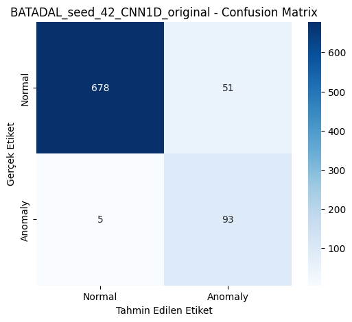

**BATADAL — GRU Confusion Matrix (Seed 42, Orijinal)**

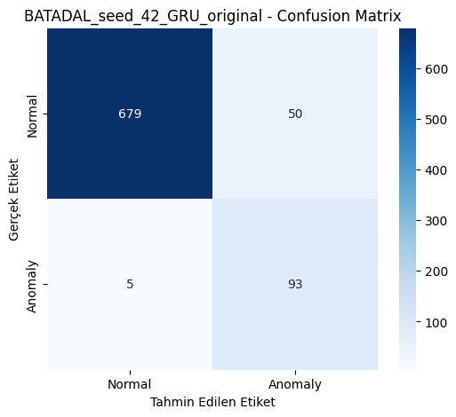

**BATADAL — LSTM ROC Eğrisi (Seed 42, Orijinal)**

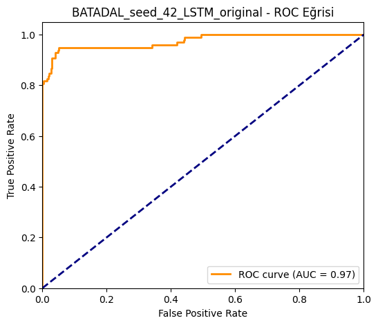

**BATADAL — GRU Precision-Recall Eğrisi (Seed 42, Orijinal)**

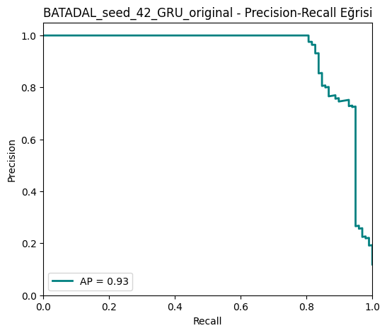

**SKAB — 1D-CNN Confusion Matrix (Seed 42, Fold 2, Orijinal — en yüksek F1 fold)**

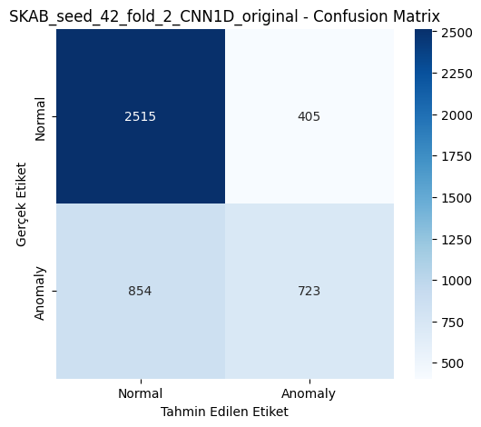

**SKAB — 1D-CNN PR Eğrisi (Seed 42, Fold 2, Gürültülü)**

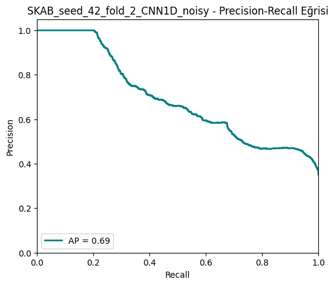

### Otomata ve Parametre Grafikleri

**BATADAL — Otomata State Diagram (Seed 42)**

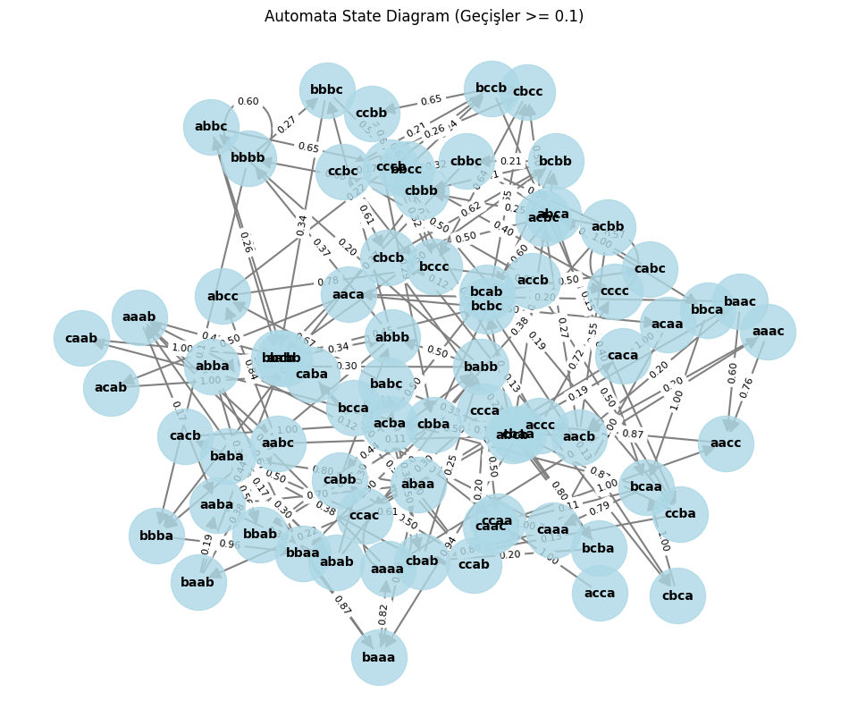

**BATADAL — Geçiş Olasılığı Heatmap (Seed 42)**

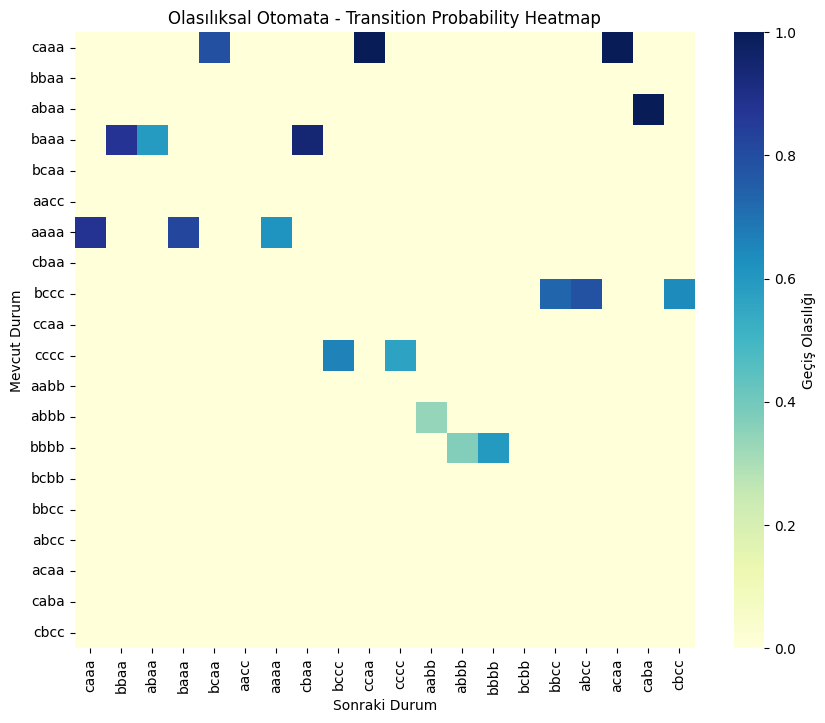

**SKAB — Otomata State Diagram (Seed 42)**

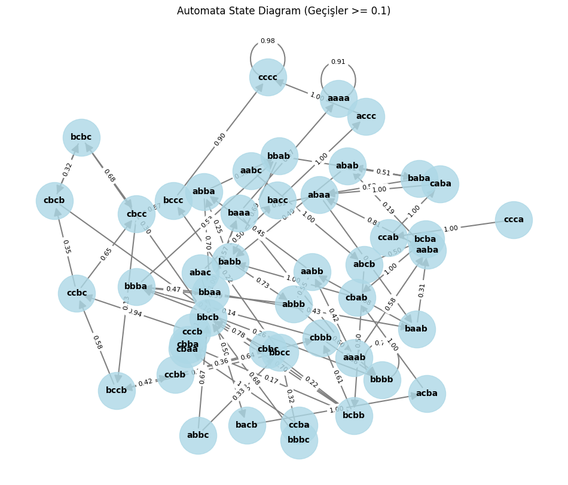

**SKAB — Window Size vs F1 Parametre Duyarlılığı**

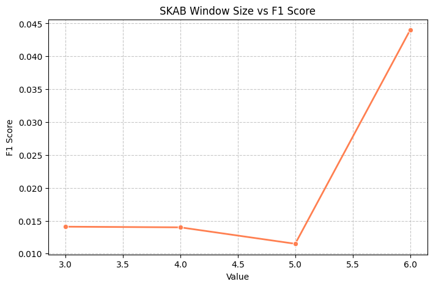

**BATADAL — Alphabet Size vs F1 Parametre Duyarlılığı**

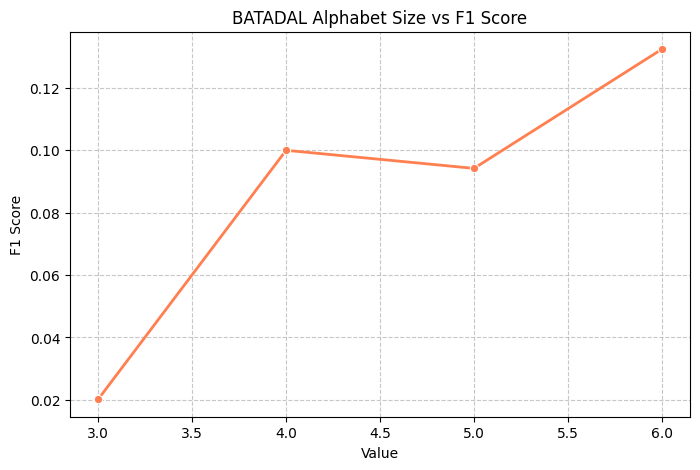

---

## 12. Kurulum ve Çalıştırma

### Gereksinimler

- Python 3.10+
- TensorFlow 2.13+

### Kurulum

```bash
python -m venv venv
venv\Scripts\activate        # Windows
pip install -r requirements.txt
```

### Veri Setlerini Yerleştirme

```
data/raw/
├── SKAB/
│   ├── valve1/   (*.csv)
│   └── valve2/   (*.csv)
└── BATADAL_dataset04.csv
```

Veri doğrulama:

```bash
python scripts/check_data.py
```

### Deneyi Çalıştırma

```bash
python main.py
# veya
run.bat
```

Hızlı test modu (`configs/config.json`):

```json
"quick_test": {
  "enabled": true,
  "seeds": [42],
  "skab_folds": 2,
  "epochs": 3
}
```

### Birim Testler

Levenshtein ve unseen pattern yönetimi birim testleri:

```bash
python -m pytest tests/test_automata.py -v
```

9 test senaryosu: Levenshtein mesafesi, unseen eşleme, path probability, confidence değerlendirme, bilinmeyen geçiş olasılığı.

---

## 13. Sonuç ve Tartışma

### Veri Setleri Arası Karşılaştırma

| Bulgu | Açıklama |
|-------|----------|
| BATADAL performansı | DL modelleri yüksek recall (≈0.95) ile F1 ≈ 0.76–0.77 |
| SKAB performansı | Fold'a bağlı yüksek varyans; ortalama F1 ≈ 0.17 (LSTM), 0.12 (GRU), 0.26 (1D-CNN) |
| Runtime | 1D-CNN en hızlı eğitim (24 sn); GRU en yavaş (70 sn); otomata < 0.1 sn |
| Otomata | Her iki sette düşük recall; path probability eşiği (0.05) anomali yakalamayı sınırlar |
| Açıklanabilirlik | Otomata her karar için olasılıksal gerekçe sunar; DL modelleri black-box kalır |

### Olasılıksal Yorum

- **Düşük path probability** → Beklenmeyen davranış, anomali adayı
- **Yüksek path probability** → Normal operasyon
- Otomata'nın düşük F1'si, sembolik temsilin bilgi kaybına uğraması ve eşik seçiminin optimize edilmemiş olmasıyla açıklanabilir; bu durum raporda dürüst biçimde tartışılmıştır.

### Proje Kapsamı

Bu proje, tek bir en iyi model belirlemekten ziyade farklı modelleme paradigmlarının **sistematik karşılaştırmasını** amaçlamaktadır. DL modelleri doğruluk odaklı senaryolarda, otomata ise yorumlanabilirlik gerektiren senaryolarda değerlendirilebilir alternatifler sunmaktadır.

---

## 14. Referanslar

1. SKAB Dataset — Skoltech Anomaly Benchmark. https://github.com/waico/SKAB
2. BATADAL — Battle of the Attack Detection Algorithms. https://batadal.net/
3. Lin, J., et al. (2007). *Experiencing SAX: A Novel Symbolic Representation of Time Series.*
4. Senin, P., & Malinchik, S. (2013). *SAX-VSM: Interpretable Time Series Classification.*
5. Hochreiter, S., & Schmidhuber, J. (1997). *Long Short-Term Memory.*
6. Levenshtein, V. I. (1966). *Binary Codes Capable of Correcting Deletions, Insertions and Reversals.*

---

## Grup Üyeleri

| # | Ad Soyad | Öğrenci No |
|---|----------|------------|
| 1 | İbrahim Alperen KESKİN | 231307052 |
| 2 | Oğuzhan ATILKAN | 231307085 |

---

*Deney ID: `20260607_044225` | Log: `logs/exp_20260607_044225.json` | Özet: `logs/experiment_summary.csv` | EK Tablolar: `logs/EK_RAPOR_TABLOLARI.md`*
